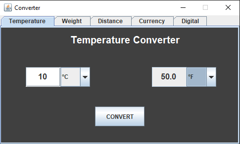
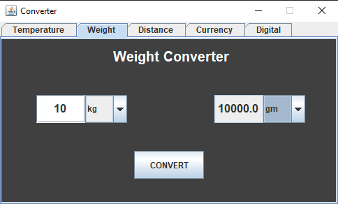

# Converter-Java
A simple GUI version unit converter in java
 
### Languages & tools :

  

|Temperature Converter| Weight Converter |
|------|-------|
|||

### Directory Structure :
    |-- out
    |-- src
    |   |-- com
    |       |-- converter
    |           |-- Main.java
    |           |-- Functions.java
    |           |-- Screen.java
    |          
    |-- Converter-Java.iml
    |
    |-- Img
    |   |-- intellij.png
    |   |-- java.png
    |   |-- converterJava1.png
    |   |-- converterJava2.png
    |
    |-- README.md

